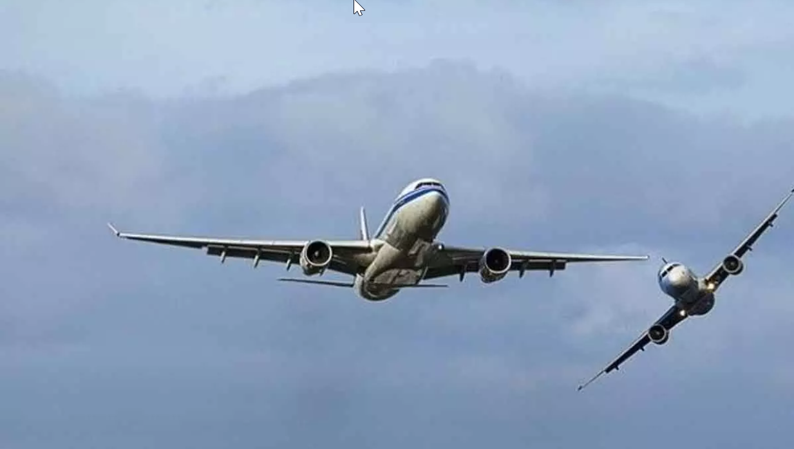

Every day, thousands of commercial aircraft move through shared airspace, guided by air traffic control and strict separation rules. If that separation breaks down, two aircraft can converge at ver[...]

**Phase 1** focuses on building the machine learning and deep learning collision detection engine. It monitors live airspace and predicts collision risk before a situation becomes critical.

The system uses real telemetry from the OpenSky Network, including position, speed, altitude, and heading from active flights. From this data, it computes aviation and physics features such as time[...]

An XGBoost classifier and an LSTM model are trained on historical NTSB accident data and ADS B trajectories. Their outputs are combined in an ensemble and optimized with ONNX quantization for fast [...]

At its core, **Phase 1** gives ATC, pilots, analysts, and researchers a clear real time view of potentially dangerous aircraft interactions, with transparent risk scoring and telemetry context.

**Phase 2** adds a GenAI reasoning and explanation layer. A high risk score alone is not enough for operational decision making. People also need to understand why a situation is dangerous, what s[...]

To solve this, **Phase 2** builds an intelligence layer over the detection engine. A Mistral 7B model is fine tuned on aviation specific data, including decoded METAR reports, TCAS advisory scenar[...]

A LangGraph agent orchestrates the flow. When a high risk pair appears, it gathers telemetry, runs prediction, retrieves related incidents, checks separation guidance, and produces a cited briefin[...]

The final result is a system that not only detects risk but also explains it with evidence, history, and regulatory context in real time.
